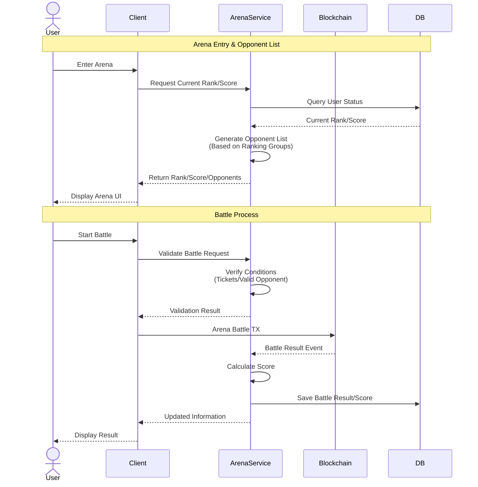

# Arena Service

Arena Service is a standalone service that manages the PvP system for Nine Chronicles. It separates score calculation and matching systems from the blockchain to provide a more flexible and scalable architecture.

## System Architecture

The service operates between the game client and the blockchain, managing all arena-related data and game logic while using the blockchain only for battle verification and recording.



## Technical Stack

- **Framework**: .NET 7
- **Database**: PostgreSQL with Entity Framework Core
- **API**: REST API with ASP.NET Core
- **Authentication**: JWT-based authentication

## Key Features

1. **Score Management**
   - Calculates and stores player scores independently from the blockchain
   - Updates rankings at specific intervals (ticket refill timing)
   - Maintains historical battle records

2. **Opponent Matching**
   - Generates opponent lists based on player ranking groups
   - Supports paid list refresh using Crystal/NCG
   - Prevents duplicate matches within the same refresh period

3. **Battle Verification**
   - Validates battle requests before blockchain submission
   - Records battle results and updates scores accordingly
   - Manages ticket consumption and refresh timing

4. **Ranking System**
   - Maintains real-time player rankings
   - Updates rankings at specific intervals
   - Supports different scoring rules for different ranking groups

## Configuration

```json
{
  "Database": {
    "ConnectionString": "Host=localhost;Database=arena;Username=user;Password=pass"
  },
  "Arena": {
    "TicketRefillInterval": "12:00:00",
    "InitialTickets": 5,
    "MaxTickets": 100,
    "RefreshCosts": {
      "Initial": "Free",
      "Crystal": 10000,
      "NCG": 1
    }
  }
}
```

## Getting Started

1. Install dependencies:
```bash
dotnet restore
```

2. Update database:
```bash
dotnet ef database update
```

3. Run the service:
```bash
dotnet run
```

## API Documentation

Detailed API documentation is available through Swagger at `/swagger` when running in development mode.

## Contributing

Please read [CONTRIBUTING.md](CONTRIBUTING.md) for details on our code of conduct and the process for submitting pull requests.

## License

This project is licensed under the MIT License - see the [LICENSE.md](LICENSE.md) file for details.
